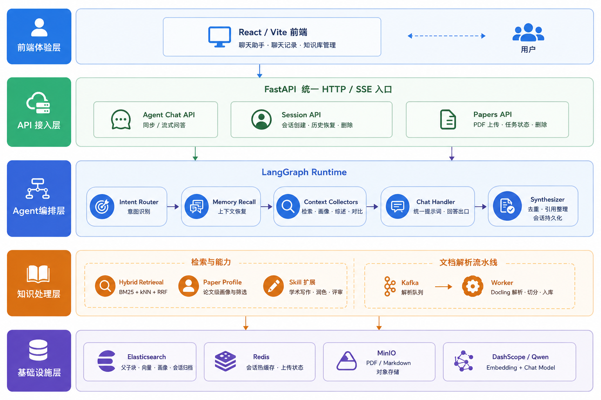
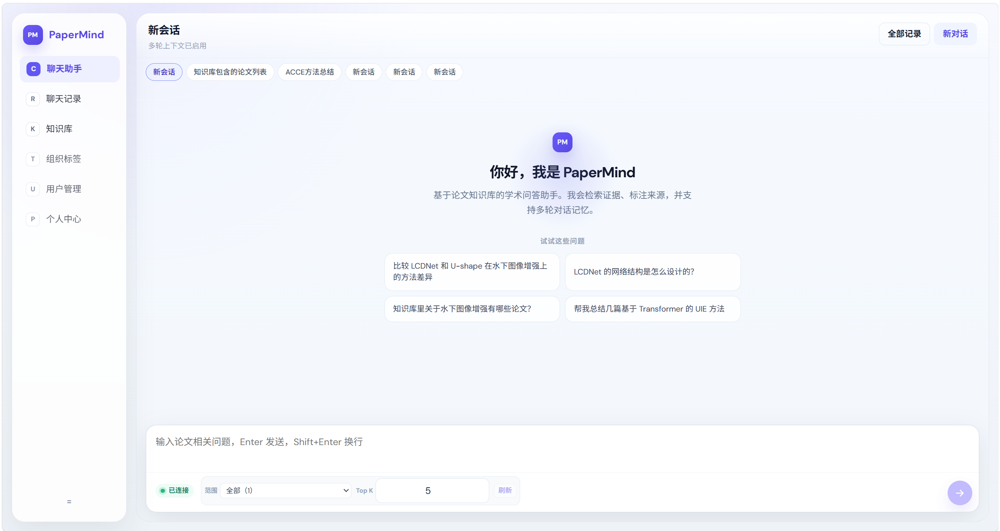

# PaperMind

PaperMind 是一个面向科研论文的 Agent-first 知识库系统。支持 PDF 上传、异步解析、Parent-Child 切分、DashScope embedding、Elasticsearch 混合检索、论文级画像检索，以及一个**统一 Chat 出口的 LangGraph Agent**。系统支持接入外部 Claude Code Skill 包以扩展写作与评审能力，并提供 ChatGPT 式的多轮会话管理。

## 架构概览

PaperMind 的核心目标是把“论文知识库”包装成一个可持续对话的研究助手。系统整体分为 **前端体验层、API 接入层、Agent 编排层、知识处理层、基础设施层** 五层：



**这张图可以按三步讲：**

1. **用户入口**：React / Vite 前端提供聊天助手、聊天记录和知识库管理，FastAPI 统一承接 REST 与 SSE 流式响应。
2. **智能中枢**：LangGraph Agent 负责意图识别、会话恢复、上下文收集和统一回答生成，避免多个模块各自生成答案造成风格不一致。
3. **知识底座**：PDF 上传后进入 Kafka + Worker 的异步解析流水线；论文块、向量、画像和会话归档沉淀到 Elasticsearch，Redis 负责热会话和上传状态，MinIO 存储原始文件与解析结果。

**架构亮点：**

- **统一 Chat 出口**：所有复杂能力最终汇聚到 `chat_handler`，回答风格、引用组织和多轮上下文处理保持一致。
- **上下文收集与生成解耦**：检索、画像、对比、写作等模块负责“找材料”，最终表达由统一 LLM 出口完成。
- **可恢复会话**：Redis 保存同会话最近窗口，ES Episodic 保存完整会话原文，支持聊天记录页重新打开历史对话。
- **异步论文入库**：上传接口不阻塞解析流程，PDF 解析、切分、embedding 与索引由 Worker 后台完成。
- **可扩展研究能力**：Agent 工具注册表和 Skill 系统让检索、写作、润色、评审能力可以逐步扩展，而不破坏主链路。

## 前端界面预览

前端采用 React / Vite 构建，主界面包含聊天助手、聊天记录、知识库管理等入口，并支持会话切换、检索范围选择、流式回答和引用来源查看。



## 目录结构

```text
.
├── app/
│   ├── main.py
│   ├── api/v1/
│   │   ├── router.py                    # 聚合 /api/v1/*
│   │   ├── sessions.py                  # 会话 CRUD + 历史恢复
│   │   ├── _helpers.py                  # upload helpers
│   │   ├── upload.py                    # PDF / multipart upload
│   │   └── tasks.py                     # task status & delete
│   ├── agent/
│   │   ├── api.py                       # POST /api/v1/agent/chat
│   │   ├── runtime.py                   # LangGraph entry, sync + SSE stream
│   │   ├── state.py                     # AgentState TypedDict
│   │   ├── builder.py                   # StateGraph assembly
│   │   ├── synthesizer.py               # dedup + persist + final answer
│   │   ├── prompts.py / session.py      # system prompts / request helpers
│   │   ├── routing/
│   │   │   ├── intent.py                # 两层意图路由 (rule + LLM)
│   │   │   ├── routes.py                # 图条件边路由
│   │   │   └── memory_recall.py         # Redis 会话上下文恢复
│   │   ├── planning/
│   │   │   ├── planner.py               # 结构化任务拆解
│   │   │   └── validator.py             # Plan 归一化 + 降级
│   │   ├── handlers/
│   │   │   ├── chat.py                  # ★ 统一 LLM 出口 (所有 intent 汇聚)
│   │   │   ├── retrieval.py             # 上下文收集器 (检索证据)
│   │   │   ├── profile.py               # 上下文收集器 (论文发现)
│   │   │   ├── summary.py               # 文献综述生成
│   │   │   └── writing.py               # 学术润色 / 同行评审
│   │   ├── workflows/comparison/        # 论文对比子图 (9 nodes + Send + retry)
│   │   ├── schemas/                     # AgentPlan, PlanStep, reducers
│   │   └── tools/                       # 22 个 LangChain tools + registry
│   ├── services/
│   │   ├── llm.py / qa.py / retrieval.py
│   │   ├── indexing.py / docling.py
│   │   ├── skills.py / tasks.py
│   │   ├── memory/                      # 三层记忆 + Redis 会话
│   │   │   ├── models.py / config.py    # MemoryItem, MemoryConfig
│   │   │   ├── working.py               # WorkingMemory (内存 + TTL)
│   │   │   ├── semantic.py              # SemanticMemory (ES 向量)
│   │   │   ├── episodic.py              # EpisodicMemory (按会话文档)
│   │   │   ├── session_store.py         # Redis 双 Key 滑动窗口
│   │   │   ├── manager.py               # MemoryManager 编排
│   │   │   └── store.py                 # JsonMemoryStore (向后兼容)
│   │   ├── papers/                      # search / index / profile
│   │   └── storage/                     # es / minio / kafka / redis / docstore / embedding
│   ├── shared/                          # 纯工具 (serializers, dedup, chunking)
│   ├── core/                            # config, logging, schemas
│   └── workers/                         # Kafka consumer, index rebuild
├── fronted/                             # Vite + React 前端
│   └── src/
│       ├── App.tsx                      # 主界面 (Chat + 知识库 + 聊天记录)
│       ├── api/papers.ts                # 所有 API 调用
│       ├── types/api.ts                 # TypeScript 类型定义
│       └── components/                  # ChatPanel, RecordsPanel, SourcesPanel
├── tests/unit/                          # 193 个单元测试
├── docker-compose.yml
├── requirements.txt
└── .env.example
```

## API 入口

| Endpoint | 用途 |
|----------|------|
| `GET /health` | 健康检查 |
| `POST /api/v1/sessions` | 创建新会话 |
| `GET /api/v1/sessions` | 会话列表 |
| `GET /api/v1/sessions/{id}` | 会话详情 |
| `GET /api/v1/sessions/{id}/history` | 恢复会话完整对话历史 |
| `PATCH /api/v1/sessions/{id}` | 更新会话标题 |
| `DELETE /api/v1/sessions/{id}` | 删除会话 + Redis + ES |
| `POST /api/v1/agent/chat` | **Agent 研究助手（统一问答入口）** |
| `POST /api/v1/agent/chat/stream` | Agent SSE 流式回答 |
| `POST /api/v1/papers/upload` | 上传 PDF 并投递解析任务 |
| `POST /api/v1/papers/upload/multipart/*` | 分片上传大 PDF |
| `GET /api/v1/papers` | 查看最近任务 |
| `GET /api/v1/papers/{task_id}` | 查询任务状态 |
| `DELETE /api/v1/papers/{task_id}` | 删除任务及相关存储 |
| `DELETE /api/v1/papers/batch` | 批量删除任务 |

> **多轮会话**：传入 `session_id` 启用。Redis 缓存同会话最近 10 轮，ES Episodic 永久存档完整原文。新建会话后 AI 自动根据首条消息生成标题。切换/删除会话通过 Session API 管理。

## Agent 架构

### 统一 Chat 出口

所有 intent 最终汇聚到 `chat_handler`——单一 LLM 调用、单一系统提示词、单一回答出口：

```
用户 query → intent_router → memory_recall (Redis 会话恢复)
                                │
              ┌─────────────────┼─────────────────┐
              ▼                 ▼                  ▼
         chat/writing     retrieval/summary    comparison
         (直连 chat)      (收集论文上下文)    (对比子图)
              │                 │                  │
              └─────────────────┼──────────────────┘
                                ▼
                          chat_handler ★
                    系统提示词 + 对话历史 + 上下文
                                │
                                ▼
                       统一 LLM 回答 → 存 Redis → 返回前端
```

### 会话记忆系统

```
Redis (热缓存)                    ES Episodic (永久存档)
  session:{id} → Hash              每个会话一个文档
    title, turn_count, ...           { session_id, title, turns: [
  history:{id} → List                     {role, content, intent, ...},
    LPUSH + LTRIM 0..9                   ...
    最近 10 轮 (仅同会话)              ]
                                      }
  24h TTL, 每次请求刷新              90 天保留, 支持跨会话搜索
```

### Agent 工具一览 (22 个)

| 分类 | 工具 | 功能 |
|------|------|------|
| 检索 | `retrieve_evidence` | BM25+kNN+RRF 混合检索 |
| 检索 | `answer_with_rag` | 检索 + LLM 生成答案 + 引用标注 |
| 检索 | `search_paper_profiles` | 论文级画像检索 |
| 检索 | `deep_search_papers` | 论文检索 + 证据依据 |
| 检索 | `get_paper_profile` | 单篇论文画像 |
| 检索 | `search_paper_chunks` | retrieve_evidence 别名 |
| 任务 | `get_task_status` | 查询解析/入库状态 |
| 记忆 | `remember_fact` / `recall_memory` | JSON 三级记忆读写 |
| 记忆 | `update_workspace_state` / `get_workspace_state` | 研究工作流状态 |
| 记忆 | `search_memories` | 三层语义搜索 |
| 记忆 | `consolidate_memories` | Working → Semantic 固化 |
| 记忆 | `forget_memories` | 过期清理 |
| 记忆 | `get_memory_stats` | 记忆统计 |
| 写作 | `generate_review_outline` | 综述大纲 |
| 写作 | `generate_review_section` | 按 Nature 标准起草段落 |
| 写作 | `polish_academic_text` | Nature 期刊标准润色 |
| 写作 | `peer_review_draft` | 结构化同行评审 |
| Skill | `list_available_skills` / `load_skill` / `use_skill_reference` | Skill 管理 |

| Profile | 工具数 | 适用场景 |
|---------|--------|----------|
| `basic` | 6 | 检索 + 论文搜索 + 任务状态 |
| `research` | 13 | basic + 记忆 + skill 管理 |
| `writing` | 12 | 检索 + 记忆 + LLM 写作 |
| `workflow` | 15 | research + LLM 写作 |
| `all` | 22 | 全部工具 |

## 示例请求

```bash
# 1. 创建新会话
curl -X POST http://localhost:8000/api/v1/sessions
# → {"session_id": "abc123", "title": "新会话", ...}

# 2. 首轮对话 (Agent 自动生成标题)
curl -X POST http://localhost:8000/api/v1/agent/chat \
  -H "Content-Type: application/json" \
  -d '{"query":"帮我找几篇和水下图像增强相关的论文，并说明依据","session_id":"abc123","top_k":5}'

# 3. 多轮追问 (Agent 记住上下文)
curl -X POST http://localhost:8000/api/v1/agent/chat \
  -H "Content-Type: application/json" \
  -d '{"query":"第一篇的方法是什么？","session_id":"abc123"}'
```

响应示例：

```json
{
  "query": "帮我找几篇和水下图像增强相关的论文",
  "answer": "根据知识库检索结果，找到以下相关论文：\n\n1. ...",
  "contexts": [...],
  "sources": [{ "paper_id": "...", "title": "...", "score": 0.92 }],
  "used_tools": ["search_paper_profiles", "retrieve_evidence"]
}
```

## 基础设施

| 服务 | 宿主机地址 | 说明 |
|------|-----------|------|
| MinIO | `9000` / 控制台 `9001` | PDF / Markdown 对象存储 |
| Redis | **`6380`** → 容器 `6379` | 会话记忆 + 上传状态 |
| Kafka | `9092` | 解析任务队列 |
| Elasticsearch | **`9201`** → 容器 `9200` | 父/子块 + 论文索引 + Episodic 会话 |

关键 `.env` 配置：

```env
REDIS_URL=redis://localhost:6380/2
ES_HOSTS=http://localhost:9201
KAFKA_BOOTSTRAP_SERVERS=localhost:9092
DASHSCOPE_API_KEY=your_key
```

## Quick Start

```bash
cp .env.example .env
# 编辑 .env，填入 DASHSCOPE_API_KEY
docker compose up -d
pip install -r requirements.txt

# Terminal 1: API
uvicorn app.main:app --reload --host 0.0.0.0 --port 8000

# Terminal 2: Worker
python -m app.workers.consumer

# Terminal 3: Frontend
cd fronted && npm install && npm run dev
```

## 测试

```bash
# Agent + 工作流
python -m unittest tests.unit.test_langgraph_agent tests.unit.test_comparison_workflow -v

# 记忆系统
python -m unittest tests.unit.test_memory_system -v

# Redis 会话 (mock)
python -m unittest tests.unit.test_session_memory -v

# 会话 API + Episodic
python -m unittest tests.unit.test_session_api -v

# 全部 (193 tests)
python -m unittest discover tests/ -v
```

## 当前状态

**已完成：**
- PDF 上传/分片上传、Kafka 异步解析、MinIO 存储
- Docling 解析、Parent-Child 切分入库（顺序索引/父块链表）
- Elasticsearch 双索引 + dense_vector + BM25+kNN+RRF 混合检索
- 论文画像抽取（LLM + 规则兜底）与论文级检索
- **统一 Chat 出口的 LangGraph Agent**（intent_router → memory_recall → context collectors → chat_handler）
- **Redis 双 Key 会话记忆**（10 轮滑动窗口，同会话隔离）+ ES Episodic 永久存档
- **ChatGPT 式会话管理**（创建/列表/切换/删除 + AI 自动标题）
- 22 个 Agent 工具 + 5 种 Tool Profile
- 外部 Skill 包接入（4 个预装 Skill）
- 前端会话列表、聊天记录页、历史会话恢复、来源引用侧栏
- 193 个单元测试

**进行中 / 暂未实现：**
- 前端对 Agent 路由 / 工具调用 / Skill 加载的完整可视化
