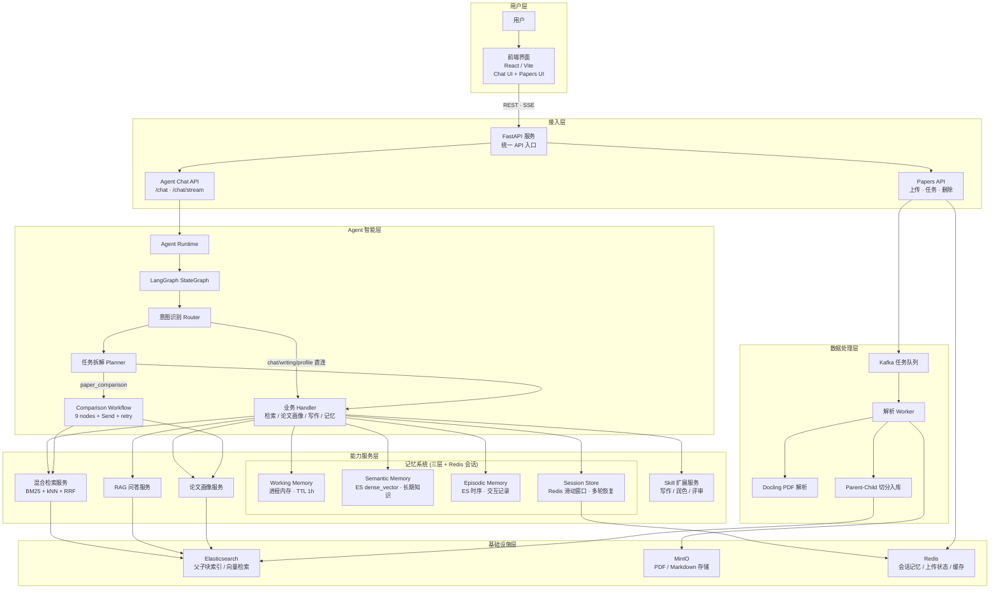

# PaperMind

PaperMind 是一个面向科研论文的 Agent-first 知识库系统。当前版本支持 PDF 上传、异步解析、Parent-Child 切分、Qwen/DashScope embedding、Elasticsearch 混合检索、论文级画像检索，以及一个可自主调用 18 种工具的研究 Agent。**系统支持接入外部 Claude Code Skill 包以扩展写作与评审能力。**

## PaperMind 架构概览



核心原则：

- **Agent-first**：所有问答请求统一走 Agent，由 Agent 自主选择工具、获取证据、组织回答。
- **Skill 扩展**：Agent 可动态加载外部 Claude Code Skill 包（nature-skills、academic-research-skills），获取学术写作、润色、评审等领域的专业规则。
- **RAG**：子块向量检索 → 父块回溯（可选拼接 `next_parent_id` 邻接父块）；证据能力以 Tool / Handler 形式被 Agent 调用。
- **LangGraph**：`intent_router` →（`chat` / `writing` / `profile` 直连 handler，跳过 planner）→ 其余 intent `planner` → `plan_validate` → 按 `task_type` 路由；**论文对比**走独立 `comparison_subgraph`（`targets`×`aspects` + Send 并行 + `coverage_check` + 缺失项定向重试），其余 intent 走 handler → `synthesizer`。
- **三层记忆**：Working（进程内存 TTL 1h）→ Semantic（ES 向量检索，长期知识）→ Episodic（ES 时序，交互记录）。生命周期覆盖 encode → store → retrieve → consolidate → forget，检索采用 `向量相似度 × 时间衰减 × 重要性加权`。
- **Redis 会话记忆**：双 Key 结构（`session:{id}` + `history:{id}`），滑动窗口 20 轮，解耦 HTTP/WebSocket 连接与对话状态。同一 `session_id` 跨请求恢复完整上下文，支持网络断开重连后多轮连续推理。
- **Agent 只做调度与汇总**：理解用户目标、选择工具、组织答案，论文事实必须来自工具返回结果。

## 目录结构

```text
.
├── app/
│   ├── main.py                          # FastAPI entry + lifespan
│   ├── api/v1/
│   │   ├── router.py                    # aggregates /api/v1/*
│   │   ├── _helpers.py                  # upload helpers
│   │   ├── upload.py                    # PDF / multipart upload
│   │   └── tasks.py                     # task status & delete
│   ├── agent/
│   │   ├── api.py                       # POST /api/v1/agent/chat endpoint
│   │   ├── runtime.py                   # LangGraph entry, sync + SSE stream
│   │   ├── state.py                     # AgentState TypedDict
│   │   ├── builder.py                   # StateGraph assembly
│   │   ├── synthesizer.py              # final answer dedup + format
│   │   ├── prompts.py                   # system prompt sections
│   │   ├── session.py                   # request/session constraints
│   │   ├── routing/
│   │   │   ├── intent.py                # 两层意图路由 (rule + LLM)
│   │   │   └── routes.py               # 图条件边路由
│   │   ├── planning/
│   │   │   ├── planner.py              # 结构化任务拆解
│   │   │   └── validator.py            # Plan 归一化 + 降级
│   │   ├── handlers/
│   │   │   ├── chat.py                  # 闲聊 / 能力说明
│   │   │   ├── profile.py              # 论文发现 / 筛选
│   │   │   ├── retrieval.py            # RAG 问答 (plan-driven + MQE)
│   │   │   ├── summary.py              # 文献综述生成
│   │   │   └── writing.py              # 学术润色 / 同行评审
│   │   ├── workflows/                    # 多节点子工作流
│   │   │   └── comparison/              # 论文对比 (9 nodes + Send + coverage)
│   │   │       ├── __init__.py          # build_comparison_subgraph
│   │   │       ├── nodes.py             # 全部节点
│   │   │       ├── dispatch.py          # Send fan-out
│   │   │       └── routing.py           # coverage → retry
│   │   ├── schemas/
│   │   │   ├── plan.py                  # 结构化 AgentPlan (targets / aspects)
│   │   │   ├── types.py                 # PlanStep TypedDict
│   │   │   └── reducers.py             # 并行 state 合并
│   │   ├── tools/
│   │   │   ├── contracts.py             # unified ToolResult JSON contract
│   │   │   ├── decorators.py            # LangChain @tool shim
│   │   │   ├── registry.py              # lazy tool registry (5 profiles)
│   │   │   ├── rag.py                   # retrieve_evidence / answer_with_rag
│   │   │   ├── papers.py               # paper discovery / profile tools
│   │   │   ├── tasks.py                # get_task_status
│   │   │   ├── memory.py               # session/user/project/workspace memory
│   │   │   ├── writing.py              # LLM-powered review/polish/peer-review
│   │   │   └── skills.py               # list_skills / load_skill / use_skill_reference
│   │   └── skills/                      # installed external skill packs
│   ├── services/
│   │   ├── llm.py                       # LLM factory (Qwen, streaming)
│   │   ├── qa.py                        # RAG 问答链
│   │   ├── retrieval.py                 # BM25 + kNN + RRF + MQE
│   │   ├── indexing.py                  # Parent-Child 切分 + ES 入库
│   │   ├── docling.py                   # Docling PDF 解析
│   │   ├── skills.py                    # SKILL.md parser + cache
│   │   ├── memory/                       # 三层记忆系统 + Redis 会话
│   │   │   ├── models.py                # MemoryItem, MemoryType, MemoryScope
│   │   │   ├── config.py                # MemoryConfig (TTL, 容量, 衰减)
│   │   │   ├── working.py               # WorkingMemory (内存 + TTL)
│   │   │   ├── semantic.py              # SemanticMemory (ES 向量检索)
│   │   │   ├── episodic.py              # EpisodicMemory (ES 时序)
│   │   │   ├── session_store.py         # Redis 双 Key 滑动窗口会话
│   │   │   ├── manager.py               # MemoryManager 统一编排
│   │   │   └── store.py                 # JsonMemoryStore (向后兼容)
│   │   ├── tasks.py                     # 任务状态 CRUD
│   │   ├── papers/
│   │   │   ├── search.py               # 论文级检索 + 聚合
│   │   │   ├── index.py                # ES 论文索引操作
│   │   │   └── profile.py              # LLM 论文画像抽取
│   │   └── storage/
│   │       ├── es.py                    # ES indices + dense_vector store
│   │       ├── minio.py                 # MinIO 对象存储
│   │       ├── kafka.py                 # Kafka producer
│   │       ├── redis.py                 # Redis 上传状态
│   │       ├── docstore.py             # Elasticsearch docstore
│   │       └── embedding.py            # DashScope / local embeddings
│   ├── shared/                          # 纯工具函数 (仅依赖 core)
│   │   ├── serializers.py              # chunk_to_result, result_to_source
│   │   ├── dedup.py                     # context/source 去重
│   │   ├── chunking.py                  # Markdown → Documents
│   │   ├── token_splitting.py           # Token-level text splitter
│   │   └── paper_utils.py              # 论文结构抽取
│   ├── core/                            # config, logging, Pydantic schemas
│   └── workers/                         # Kafka consumer, index rebuild CLI
├── fronted/                             # Vite + React frontend
├── tests/
│   └── unit/                            # agent/tool/memory unit tests
├── docker-compose.yml
├── requirements.txt
└── .env.example
```

## API 入口

| Endpoint                                    | 用途                     |
| ------------------------------------------- | ------------------------ |
| `GET /health`                               | 健康检查                 |
| `POST /api/v1/agent/chat`                   | **Agent 研究助手（唯一问答入口）** |
| `POST /api/v1/agent/chat/stream`            | Agent SSE 流式回答（检索/plan 后流式生成正文） |
| `POST /api/v1/papers/upload`                | 上传单个 PDF 并投递解析任务     |
| `POST /api/v1/papers/upload/multipart/*`    | 分片上传大 PDF               |
| `GET /api/v1/papers`                        | 查看最近任务                 |
| `GET /api/v1/papers/{task_id}`              | 查询任务状态                 |
| `DELETE /api/v1/papers/{task_id}`           | 删除任务及相关存储              |
| `DELETE /api/v1/papers/batch`               | 批量删除任务                 |

> **多轮对话**：在请求体中传入 `session_id` 即可启用。同一 `session_id` 的多次请求自动串联为多轮对话——Agent 通过 Redis 双 Key 结构恢复完整上下文，支持网络断开重连后继续推理。滑动窗口默认保留最近 20 轮。

## Agent 工具一览

所有工具由 Agent 根据用户问题自动选择，用户无需手动指定。

### 检索与知识库（6 个）

| 工具                       | 功能                                     |
| -------------------------- | ---------------------------------------- |
| `retrieve_evidence`        | BM25+kNN+RRF 混合检索细粒度证据           |
| `answer_with_rag`          | 检索 + LLM 生成答案 + 引用标注            |
| `search_paper_chunks`      | retrieve_evidence 别名                    |
| `search_paper_profiles`    | 论文级画像检索（发现、筛选、推荐）         |
| `deep_search_papers`       | 论文检索 + 附带证据依据                   |
| `get_paper_profile`        | 单篇论文画像（摘要、方法、贡献等）         |

### 任务与记忆（9 个）

| 工具                       | 层级         | 功能                                     |
| -------------------------- | ------------ | ---------------------------------------- |
| `get_task_status`          | —            | 查询上传/解析/入库状态                    |
| `remember_fact`            | JsonMemory   | 存储 session/user/project 三级记忆        |
| `recall_memory`            | JsonMemory   | 读取三类记忆 (字符串匹配)                 |
| `update_workspace_state`   | JsonMemory   | 更新研究工作流状态                         |
| `get_workspace_state`      | JsonMemory   | 读取当前工作流状态                         |
| `search_memories`          | 全部三层      | 语义搜索所有记忆层，返回格式化上下文       |
| `consolidate_memories`     | Working→Semantic | 高重要性工作记忆固化为长期知识          |
| `forget_memories`          | 全部三层      | 清理过期/低质量记忆（TTL + 容量淘汰）     |
| `get_memory_stats`         | 全部三层      | 记忆系统统计信息                          |

### 写作辅助（4 个，LLM 驱动 + Skill 规则增强）

| 工具                       | 功能                                     |
| -------------------------- | ---------------------------------------- |
| `generate_review_outline`  | 生成结构化综述大纲（主题分组、空白识别）     |
| `generate_review_section`  | 按 Nature 写作标准起草综述段落             |
| `polish_academic_text`     | 按 Nature 期刊标准润色学术文本             |
| `peer_review_draft`        | 结构化同行评审（评分 + 改进建议）           |

### Skill 管理（3 个）

| 工具                       | 功能                                     |
| -------------------------- | ---------------------------------------- |
| `list_available_skills`    | 列出所有已安装的 Skill 包                 |
| `load_skill`               | 加载 Skill 的完整规则到上下文              |
| `use_skill_reference`      | 读取 Skill 中的特定参考文件                |

### Tool Profile

| Profile    | 工具数 | 适用场景                               |
| ---------- | ------ | -------------------------------------- |
| `basic`    | 6      | 检索 + 论文搜索 + 任务状态              |
| `research` | 13     | basic + 记忆(4) + skill 管理            |
| `writing`  | 12     | 检索 + 记忆 + LLM 写作 + skill 管理     |
| `workflow` | 15     | research + LLM 写作 + skill 管理        |
| `all`      | 22     | 全部工具（含三层记忆检索/整合/遗忘）     |

## Skill 系统

PaperMind 支持接入外部 Claude Code Skill 包。已预装 4 个 Skill：

| Skill                         | 来源                  | 用途                             |
| ----------------------------- | --------------------- | -------------------------------- |
| `nature-polishing` v5.0.2     | Yuan1z0825/nature-skills | Nature 期刊标准学术润色          |
| `nature-writing` v0.2.0       | Yuan1z0825/nature-skills | Nature 风格学术写作（各章节模式） |
| `academic-paper` v3.1.2       | Imbad0202/academic-research-skills | 12-Agent 论文写作流程           |
| `academic-paper-reviewer`     | Imbad0202/academic-research-skills | 多视角同行评审                   |

**工作流示例** — 用户问"帮我写一篇综述"：

```
list_available_skills → 发现 4 个可用 Skill
load_skill("academic-paper") → 加载论文写作规则
load_skill("nature-polishing") → 加载润色规则
deep_search_papers → 找论文
retrieve_evidence → 检索细节
generate_review_outline → 按 ARS 模板生成大纲
generate_review_section → 按 Nature 标准起草
peer_review_draft → 自我评审
polish_academic_text → 最终润色
```

**安装新 Skill**：将 Skill 目录放入 `app/agent/skills/<vendor>/<skill-name>/`，重启 API 即可。Agent 会通过 `list_available_skills` 自动发现。

## Tool 返回协议

所有 Agent tools 统一返回 JSON 字符串：

```json
{
  "tool_name": "retrieve_evidence",
  "query": "frequency domain enhancement",
  "result_count": 1,
  "results": [],
  "sources": [],
  "error": null,
  "confidence": 0.8,
  "metadata": {}
}
```

## 基础设施与端口

| 服务 | 容器名 | 宿主机地址 | 说明 |
|------|--------|------------|------|
| MinIO | `papermind-minio` | `9000` / 控制台 `9001` | PDF / Markdown 对象存储 |
| Redis | `papermind-redis` | **`6380`** → 容器 `6379` | 分片上传状态（勿连宿主机 `6379`，常为旧版 Redis 3.x） |
| Kafka | `papermind-kafka` | `9092` | 解析任务队列（compose 内 `extra_hosts: broker→127.0.0.1`） |
| Elasticsearch | `papermind-elasticsearch` | **`9201`** → 容器 `9200` | 父/子块 + 论文级索引 |

`.env` 关键项示例：

```env
REDIS_URL=redis://localhost:6380/2
ES_HOSTS=http://localhost:9201
KAFKA_BOOTSTRAP_SERVERS=localhost:9092
DASHSCOPE_API_KEY=your_key
```

## RAG 索引说明

- **切块（token）**：父块默认 1024 / 重叠 150；子块 256 / 重叠 30（见 `CHILD_*` / `PARENT_*` 环境变量，`app/shared/token_splitting.py`）。
- **索引**：`papermind_parents`（父块全文 + 顺序元数据）、`papermind_children`（子块 + `dense_vector`）；子块 `metadata.doc_id` 指向父块 `_id`。
- **顺序字段**：`parent_index`、`child_index`、`prev_parent_id`、`next_parent_id`（入库时由 `app/services/indexing.py` 写入）。
- **检索**：子块 BM25 + kNN → RRF 聚合到父块 → `docstore` 取父文；`RETRIEVE_INCLUDE_NEXT_PARENT=true` 时拼接相邻下一块父文。
- **依赖**：建议安装 `tiktoken`（`requirements.txt`）以保证 token 切分准确。

修改切块参数或 mapping 后，需 **重新入库**（旧索引不会自动迁移）。

## Quick Start

```bash
# 1. 配置环境变量
cp .env.example .env   # Windows: copy .env.example .env
# 编辑 .env，填入 DASHSCOPE_API_KEY 等
docker compose up -d

# MinIO console : http://localhost:9001  (papermind / papermind123)
# Elasticsearch : http://localhost:9201
# Redis         : localhost:6380
# Kafka         : localhost:9092  （容器名 papermind-kafka，勿用旧 bitnami 容器 kafka）

# 2. python deps
python -m venv .venv && source .venv/bin/activate
# Windows: .venv\Scripts\activate
pip install -r requirements.txt

# 3. run API
uvicorn app.main:app --reload
# http://localhost:8000/health
# http://localhost:8000/docs
```

## Windows 启动命令

```powershell
# Terminal 1: Backend API
conda activate papermind
cd D:\Project\PaperMind
uvicorn app.main:app --reload --host 0.0.0.0 --port 8000
```

```powershell
# Terminal 2: Kafka consumer worker
conda activate papermind
cd D:\Project\PaperMind
python -m app.workers.consumer
```

```powershell
# Terminal 3: Frontend (Vite)
cd D:\Project\PaperMind\fronted
npm run dev
```

推荐顺序：

1. 先启动基础设施：`docker compose up -d`
2. 再启动后端 API：`uvicorn app.main:app --reload --host 0.0.0.0 --port 8000`
3. 再启动 worker：`python -m app.workers.consumer`
4. 最后启动前端：`cd fronted && npm run dev`

## 常见问题（Windows）

| 现象 | 处理 |
|------|------|
| 分片上传 502 / Redis 超时 | 确认 `REDIS_URL` 为 `localhost:6380`；`docker compose up redis -d` |
| `wrong number of arguments for 'hset'` | 连到了宿主机 Redis 3.x（6379），改连 Docker `6380` |
| Kafka 启动即退出 `UnknownHostException: broker` | 用 `docker compose up kafka -d` 启动 `papermind-kafka`，不要单独点旧 `kafka` 容器 |
| ES `metadata.title cannot be changed…` | 索引已存在且 mapping 冲突；删索引重建或仅增量字段（见 `vectorstore_service.ensure_indices`） |
| 解析成功但检索无结果 | 确认 worker 在跑；任务状态为 `INDEXED`；Kafka / ES 正常 |

## 示例请求

Agent 研究助手：

```bash
curl -X POST http://localhost:8000/api/v1/agent/chat \
  -H "Content-Type: application/json" \
  -d '{"query":"帮我找几篇和水下图像增强相关的论文，并说明依据","top_k":5}'
```

写综述时，Agent 会自动加载 Skill：

```bash
curl -X POST http://localhost:8000/api/v1/agent/chat \
  -H "Content-Type: application/json" \
  -d '{"query":"基于知识库里的论文，帮我写一篇关于水下图像增强方法的综述"}'
```

多轮对话（传入 `session_id` 启用会话记忆）：

```bash
# 第 1 轮
curl -X POST http://localhost:8000/api/v1/agent/chat \
  -H "Content-Type: application/json" \
  -d '{"query":"LCDNet 的方法是什么？","session_id":"my-session"}'

# 第 2 轮 — Agent 自动记住上下文，"它"指 LCDNet
curl -X POST http://localhost:8000/api/v1/agent/chat \
  -H "Content-Type: application/json" \
  -d '{"query":"它的 PSNR 指标是多少？","session_id":"my-session"}'
```

响应示例：

```json
{
  "query": "帮我找几篇和水下图像增强相关的论文，并说明依据",
  "answer": "根据知识库检索结果，找到以下水下图像增强相关论文：\n\n1. ...",
  "contexts": [...],
  "sources": [{ "paper_id": "...", "title": "...", "score": 0.92 }],
  "used_tools": ["list_available_skills", "load_skill", "deep_search_papers", "retrieve_evidence"]
}
```

## 测试与验证

```bash
# Agent / tools / memory 单元测试
python -m unittest tests.unit.test_agent_first_architecture

# LangGraph + Plan-driven 对比工作流单元测试
python -m unittest tests.unit.test_langgraph_agent tests.unit.test_comparison_workflow -v

# 三层记忆系统单元测试
python -m unittest tests.unit.test_memory_system -v

# Redis 会话记忆单元测试 (mock Redis)
python -m unittest tests.unit.test_session_memory -v

# Python 语法检查
python -m compileall app tests -q
```

### 论文对比（Plan-driven）

对比类问题（如「比较 LCDNet 和 U-shape 的方法」）由 Planner 输出结构化计划：

- `targets`：每篇论文单独 `search_papers_by_query`（不再用整句 query 搜 Top5）
- `aspects`：方法 / 实验等维度，每篇论文内 `hybrid_retrieve(task_id=paper_id, section_types=...)`
- LangGraph `Send` 并行执行检索；`coverage_check` 不足时 `query_rewrite` 仅对缺失 `(alias, aspect)` 扩写并重检（保留已有证据，默认最多重试 1 次，见 `COMPARISON_MAX_RETRY`）

## 当前状态

已完成：

- PDF 上传、分片上传、Kafka 异步解析、MinIO 存储
- Docling 解析、按章节切分 + token 级 Parent-Child 入库（顺序索引 / 父块链表）
- Elasticsearch 双索引（`papermind_parents` / `papermind_children`）+ `dense_vector`
- BM25 + kNN + 应用层 RRF，父块回溯 + 可选 next 父块扩展
- **LangGraph Agent**（intent_router → memory_recall → planner → plan_validate；对比任务独立 workflow 子图 + Send 并行）
- 论文画像抽取（LLM + 规则兜底）、索引与论文级检索
- **Agent-first 统一问答入口**（22 个工具、5 种 profile）
- **三层记忆系统**（Working 内存/Semantic ES 向量/Episodic ES 时序）+ **Redis 双 Key 会话记忆**（滑动窗口 20 轮，支持断线重连多轮推理）
- **LLM 驱动的学术写作工具**（综述大纲、段落生成、学术润色、自我评审）
- **外部 Skill 包接入系统**（预装 nature-skills + academic-research-skills，共 4 个 Skill）

部分实现 / 进行中：

- `POST /api/v1/agent/chat/stream`：对比类答案可直接使用 `compare_node` 结果；其余 intent 仍二次流式生成
- SSE `trace` 事件展示子图执行节点
- 前端来源侧栏、ChatGPT 式引用展示

暂未实现：

- 选定论文生成综述的端到端固化 workflow
- 前端对 Agent 路由 / 工具调用 / Skill 加载的完整可视化
- Semantic / Episodic memory 的 LLM 自动摘要整理
