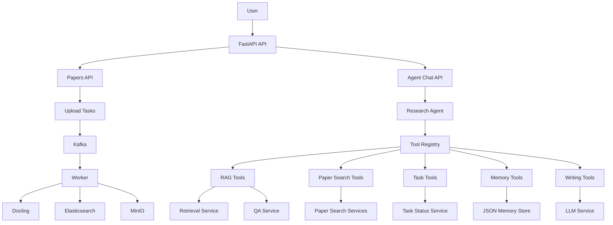

# PaperMind

PaperMind 是一个面向科研论文的 Agent-first 知识库系统。当前版本支持 PDF 上传、异步解析、Parent-Child 切分、Qwen/DashScope embedding、Elasticsearch 混合检索、论文级画像检索，以及一个可自主调用 14 种工具的研究 Agent。**所有问答均通过 Agent 入口完成。**

## 架构概览



核心原则：

- **Agent-first**：所有问答请求统一走 Agent，由 Agent 自主选择工具、获取证据、组织回答。
- **RAG**：检索证据、RAG 问答、论文对比等能力以 Tool 形式被 Agent 调用。
- **记忆**：记忆负责稳定读写，不负责判断事实真伪。Agent 通过 `remember_fact` / `recall_memory` 工具自行管理。
- **Agent 只做调度与汇总**：理解用户目标、选择工具、组织答案，论文事实必须来自工具返回结果。

## 目录结构

```text
.
├── app/
│   ├── main.py                          # FastAPI entry + lifespan
│   ├── api/v1/
│   │   ├── router.py                    # aggregates /api/v1/*
│   │   ├── _helpers.py                  # upload helpers
│   │   ├── upload.py                    # PDF / multipart upload
│   │   └── tasks.py                     # task status & delete
│   ├── agent/
│   │   ├── __init__.py
│   │   ├── api.py                       # POST /api/v1/agent/chat endpoint
│   │   ├── runtime.py                   # Agent lifecycle, message extraction
│   │   ├── prompts.py                   # system prompt sections
│   │   ├── session.py                   # request/session constraints
│   │   ├── registry.py                  # lazy tool registry (5 profiles)
│   │   └── tools/
│   │       ├── contracts.py             # unified ToolResult JSON contract
│   │       ├── decorators.py            # LangChain @tool shim
│   │       ├── paper_serializers.py     # result formatting helpers
│   │       ├── rag_tools.py             # retrieve_evidence / answer_with_rag
│   │       ├── paper_search_tools.py    # paper discovery / profile tools
│   │       ├── task_tools.py            # get_task_status
│   │       ├── memory_tools.py          # session/user/project/workspace memory
│   │       └── writing_tools.py         # review outline / section / rewrite
│   ├── services/
│   │   ├── retrieval_service.py         # BM25 + vector kNN + app-side RRF
│   │   ├── qa_service.py                # retrieve → generate RAG chain
│   │   ├── vectorstore_service.py       # Elasticsearch dense_vector store
│   │   ├── memory_store.py              # JSON-backed agent memory store
│   │   └── ...                          # MinIO, Kafka, Docling, embedding, paper index
│   ├── core/                            # config, logging, Pydantic schemas
│   ├── utils/                           # chunking, paper structure parsing
│   └── workers/                         # Kafka consumer, index rebuild CLI
├── fronted/                             # Vite + React frontend
├── tests/
│   └── unit/                            # agent/tool/memory unit tests
├── docker-compose.yml
├── requirements.txt
└── .env.example
```

## API 入口

| Endpoint                                    | 用途                     |
| ------------------------------------------- | ------------------------ |
| `GET /health`                               | 健康检查                 |
| `POST /api/v1/agent/chat`                   | **Agent 研究助手（唯一问答入口）** |
| `POST /api/v1/papers/upload`                | 上传单个 PDF 并投递解析任务     |
| `POST /api/v1/papers/upload/multipart/*`    | 分片上传大 PDF               |
| `GET /api/v1/papers`                        | 查看最近任务                 |
| `GET /api/v1/papers/{task_id}`              | 查询任务状态                 |
| `DELETE /api/v1/papers/{task_id}`           | 删除任务及相关存储              |
| `DELETE /api/v1/papers/batch`               | 批量删除任务                 |

## Agent 工具一览

所有工具由 Agent 根据用户问题自动选择，用户无需手动指定。

| 类别       | 工具                       | 功能                                     |
| ---------- | -------------------------- | ---------------------------------------- |
| RAG 检索   | `retrieve_evidence`        | BM25+kNN+RRF 混合检索细粒度证据           |
| RAG 检索   | `answer_with_rag`          | 检索 + LLM 生成答案 + 引用标注            |
| RAG 检索   | `search_paper_chunks`      | retrieve_evidence 别名                    |
| 论文搜索   | `search_paper_profiles`    | 论文级画像检索（发现、筛选、推荐）         |
| 论文搜索   | `deep_search_papers`       | 论文检索 + 附带证据依据                   |
| 论文搜索   | `get_paper_profile`        | 单篇论文画像（摘要、方法、贡献等）         |
| 任务管理   | `get_task_status`          | 查询上传/解析/入库状态                    |
| 记忆管理   | `remember_fact`            | 存储 session/user/project 三级记忆        |
| 记忆管理   | `recall_memory`            | 读取三类记忆                               |
| 记忆管理   | `update_workspace_state`   | 更新研究工作流状态                         |
| 记忆管理   | `get_workspace_state`      | 读取当前工作流状态                         |
| 写作辅助   | `draft_review_outline`     | 基于证据生成综述大纲                       |
| 写作辅助   | `draft_review_section`     | 基于证据生成综述段落                       |
| 写作辅助   | `rewrite_academic_paragraph` | 学术风格改写                             |

### Tool Profile（工具组合）

| Profile    | 包含工具数 | 适用场景                   |
| ---------- | ---------- | -------------------------- |
| `basic`    | 6          | 检索 + 论文搜索 + 任务状态 |
| `research` | 10         | basic + 四类记忆工具       |
| `writing`  | 7          | 检索 + 记忆 + 写作辅助     |
| `workflow` | 10         | research 变体 + 写作辅助   |
| `all`      | 14         | 全部工具（当前默认）        |

## Tool 返回协议

所有 Agent tools 统一返回 JSON 字符串：

```json
{
  "tool_name": "retrieve_evidence",
  "query": "frequency domain enhancement",
  "result_count": 1,
  "results": [],
  "sources": [],
  "error": null,
  "confidence": 0.8,
  "metadata": {}
}
```

## Quick Start

```bash
# 1. infra
cp .env.example .env
docker compose up -d

# MinIO console : http://localhost:9001  (papermind / papermind123)
# Elasticsearch : http://localhost:9201
# Kafka         : localhost:9092

# 2. python deps
python -m venv .venv && source .venv/bin/activate
# Windows: .venv\Scripts\activate
pip install -r requirements.txt

# 3. run API
uvicorn app.main:app --reload
# http://localhost:8000/health
# http://localhost:8000/docs
```

## Windows 启动命令

```powershell
# Terminal 1: Backend API
conda activate papermind
cd D:\Project\PaperMind
uvicorn app.main:app --reload --host 0.0.0.0 --port 8000
```

```powershell
# Terminal 2: Kafka consumer worker
conda activate papermind
cd D:\Project\PaperMind
python -m app.workers.consumer
```

```powershell
# Terminal 3: Frontend (Vite)
cd D:\Project\PaperMind\fronted
npm run dev
```

推荐顺序：

1. 先启动基础设施：`docker compose up -d`
2. 再启动后端 API：`uvicorn app.main:app --reload --host 0.0.0.0 --port 8000`
3. 再启动 worker：`python -m app.workers.consumer`
4. 最后启动前端：`cd fronted && npm run dev`

## 示例请求

Agent 研究助手：

```bash
curl -X POST http://localhost:8000/api/v1/agent/chat \
  -H "Content-Type: application/json" \
  -d '{"query":"帮我找几篇和水下图像增强相关的论文，并说明依据","top_k":5}'
```

响应示例：

```json
{
  "query": "帮我找几篇和水下图像增强相关的论文，并说明依据",
  "answer": "根据知识库检索结果，找到以下水下图像增强相关论文：\n\n1. ...",
  "contexts": [...],
  "sources": [{ "paper_id": "...", "title": "...", "score": 0.92 }],
  "used_tools": ["deep_search_papers", "retrieve_evidence"]
}
```

## 测试与验证

```bash
# Agent / tools / memory 单元测试
python -m unittest tests.unit.test_agent_first_architecture

# Python 语法检查
python -m compileall app tests -q
```

## 当前状态

已完成：

- PDF 上传、分片上传、Kafka 异步解析、MinIO 存储
- Docling 解析、Parent-Child chunking
- Elasticsearch `dense_vector` 向量检索
- BM25 + kNN + 应用层 RRF
- 论文画像抽取（LLM + 规则兜底）、索引与论文级检索
- **Agent-first 统一问答入口**（14 个工具、5 种 profile）
- session / user / project 三类 JSON 记忆 + workspace 状态
- 写作辅助工具（综述大纲、段落生成、改写）

暂未实现：

- 选定论文生成综述的完整 workflow
- Agent 流式回答
- 前端对 Agent workspace / memory 的完整可视化
